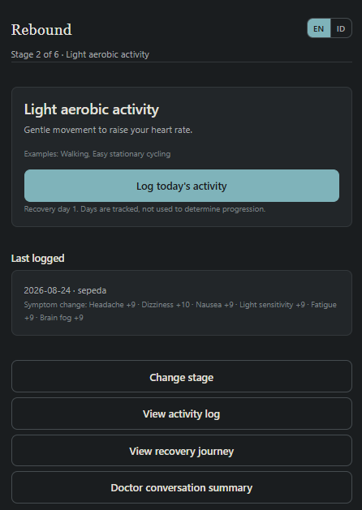

# Rebound

**Track what you feel. Bring it to the conversation.**

Rebound is a self-tracking companion for concussion recovery. It records what you did each day and how you felt before and after — and turns that into something you can bring into a conversation with your healthcare professional.

[Live demo](https://rebound-nu.vercel.app) · Built for Hack for Humanity Summer 2026

> Open the demo and choose **"Or explore a sample recovery"** to see eight days of fictional recovery data without entering anything.



## The problem

Concussion recovery is long, invisible, and hard to describe. A person is asked how they've been feeling since the last appointment, and answers from memory: *better, I think. Some days worse.*

That answer is honest and nearly useless. The information that would actually help — what activity was attempted, what symptoms preceded it, what changed afterwards — happened weeks ago and was never written down.

Meanwhile the graduated return-to-sport framework that guides recovery is public, well-documented, and almost never in the patient's hands. It lives in clinical guidance, not on the phone of the person actually doing the recovering.

## What Rebound does differently

The obvious product here is an app that tells you when you're ready for the next stage. That app would be easier to build and far more dangerous.

Rebound's starting point is the opposite:

> **Rebound records your progress. It does not determine when you should progress.**

Every design decision follows from that sentence. The app knows the framework, tracks your logs, and computes symptom differences — and then stops, deliberately, at the line where a clinical judgment would begin.

## What you can do

| Screen | What it does |
|---|---|
| **Today** | Your current stage, today's activity, one primary action. |
| **Symptom check** | Six symptoms on a 0–10 scale, before and after an activity, plus an optional note in your own words. |
| **Activity log** | Everything you recorded, newest first, including stage changes in both directions. |
| **Recovery journey** | Six-stage vertical timeline showing what you've logged. |
| **Doctor conversation summary** | Your record, formatted to bring to an appointment. Copy to clipboard. |

Stage changes — forward and backward — happen through a separate confirmation flow.

## Where the six stages come from

Rebound follows the graduated return-to-sport strategy from the **Concussion in Sport Group 6th Consensus Statement** (Amsterdam 2022, published in BJSM June 2023), whose public version is the [CDC HEADS UP return-to-play progression](https://www.cdc.gov/heads-up/guidelines/returning-to-sports.html).

This attribution appears in the app itself, not just here. When a judge or a clinician asks *why six stages*, the answer is a citation rather than a design preference.

## Why a 0–10 scale, and how a person is meant to use it

Two different scales exist in this field for two different jobs. Symptom inventories such as the SCAT post-concussion symptom scale rate many symptoms on a 0–6 scale to produce a total severity score. Exertion-related symptom exacerbation — whether an activity made things worse, which is exactly what Rebound records — is described on a 0–10 scale, and that is the scale the Amsterdam guidance uses when it describes a tolerable increase as no more than two points.

Rebound measures the second thing, so it uses 0–10.

**Rebound deliberately does not reproduce SCAT6.** That instrument may be copied freely in its original form, but digital reformatting, alteration, and translation require written permission from BMJ. Rebound is a digital reformatting by definition, so it uses its own six-symptom set with generic severity anchors rather than reproducing a licensed instrument.

Because a number a person picks from feeling alone is hard to reuse, the slider carries plain anchors — none, mild, moderate, severe — defined by function rather than sensation:

- **mild** — you notice it but carry on
- **moderate** — it interferes with what you are doing
- **severe** — you have to stop

The guidance in the app says the important part out loud: use the same judgement each time, because what carries meaning is the change from before to after, not the absolute number. Rebound never compares one person's 5 to another person's 5.

## Engineering decisions

**There is no `canAdvance()`.** No `isSafe()`, no `shouldStop()`, no `isCleared()`. Search the source — those functions do not exist. `recovery.js` exposes `calculateSymptomChanges()` and `hoursSinceLastStageChange()`: functions that return facts, never permission. Stage changes happen because a person chose to record one.

**The +2 threshold is never wired to the UI.** Published guidance describes mild, brief symptom exacerbation as potentially tolerable within stated limits. That number lives in `stages.js` as `GUIDANCE_NOTE_THRESHOLD` — and is imported by no logic module at all. It exists to be displayed as sourced reading material, not to evaluate anyone. The moment a threshold controls a button, the app has quietly become a decision engine.

**The 24-hour interval is context, not a gate.** `minimumIntervalObserved()` reports elapsed hours next to what the guidance says. It disables nothing. Someone who moves through stages faster than the guidance describes will see the fact stated and no more.

**There is no field called `worsened`.** Naming a number "worsened" is already a clinical read. Rebound stores `symptomChanges` — a per-symptom delta, reported as-is. `Dizziness 4 → 10 (+6)` appears exactly that way, with no adjective attached.

**No status badges.** Earlier drafts had "Ready to advance", then "Looks good to discuss", then "Ready for review". Each euphemism was still the app issuing a verdict. The fix was structural: remove the badge and show the observation. The person draws the conclusion.

**The clearance gate is honest about what it is.** Stages 4 and above involve risk of head impact and, per published guidance, require clearance from a healthcare professional. Rebound asks the person to confirm they have it. This is self-attestation, not verification — the app says so, and this README says so.

**Moving backwards has equal visual weight.** Guidance describes returning to an earlier step when symptoms return. An app that only moves forward implies that moving back is failure. Rebound's stage screen offers both, and the activity log records both.

**Dates order the record, not insertion order.** Both the timeline and "most recent activity" sort by the day a thing happened. Someone logging yesterday's walk this morning does not corrupt the record.

**Sample data is never written to storage.** The sample recovery lives in React state only; `save()` is skipped whenever `isSample` is set. Exploring the sample cannot overwrite a real record, and leaving it restores whatever was there before.

**No AI.** Not a limitation — a choice. Every threshold comes from published consensus guidance and runs locally as deterministic logic you can read in the source. A model making clinical judgments is precisely what this product is designed not to be.

**No database, no account, no server.** Recovery logs stay in `localStorage` on the device.

## Designed for someone who cannot read much

The audience has brain fog, fatigue, and light sensitivity. That shaped the interface more than taste did:

- Guidance is a permanent part of the screen, never a modal. A dismissible popup is the wrong format for a reader who may need to see it again tomorrow.
- The empty Today screen teaches the daily loop instead of saying "nothing here yet" — including the part that matters most, *come back tomorrow*.
- Warm off-white and muted slate rather than clinical white and pure black.
- Dark mode follows the system preference.
- `prefers-reduced-motion` respected; there is no animation anywhere in the app.
- One primary action per screen, generous type sizing.

## Interface language

An EN/ID toggle switches the entire interface, including the doctor summary. A person recovering in Indonesia can produce a summary in Indonesian to hand to an Indonesian clinician. The toggle persists across sessions.

Translation here is a safety surface, not decoration: *records* must not become *determines* in either language.

## Tech stack

React 19 · Vite · plain CSS · `localStorage`

No UI framework, no state library, no backend, no dependencies beyond React and Vite.

## Limitations

Rebound is a prototype built for a hackathon. It is a record-keeping aid, not a medical device, and not a substitute for professional diagnosis, treatment, or clearance.

Known gaps:

- The clearance confirmation is self-reported and cannot be verified.
- The symptom set is Rebound's own, with generic severity anchors. It is not a validated instrument and its scores are not comparable to SCAT, PCSS, or RPQ results.
- Symptom scores are self-reported and subjective; the same number can mean different things on different days and between people. Only the within-person change is meant to carry weight.
- Data lives in one browser on one device. Clearing browser storage deletes the record, and there is no export beyond copying the summary text.
- No automated test suite. Logic was verified through scripted simulation during development, including a regression case checking that a large symptom increase renders as a number with no verdict language attached.
- Stage completion is not inferred from logs — the person moves themselves, by design, which also means the app cannot tell whether a stage was genuinely completed.

## Running locally

```bash
npm install
npm run dev
```

Open `http://localhost:5173`. No environment variables, no API keys.

## Project structure

```
src/
  data/stages.js           six stages, symptoms, framework attribution
  data/sampleRecovery.js   eight days of fictional data, never persisted
  lib/storage.js           the only module that touches localStorage
  lib/symptoms.js          delta arithmetic — calculates, never judges
  lib/recovery.js          logs, stage changes, timeline; returns facts, not permission
  lib/summary.js           doctor conversation summary
  lib/i18n.js              EN/ID dictionaries
  components/              language toggle
  screens/                 seven screens
  index.css                design system
```

## License

MIT
